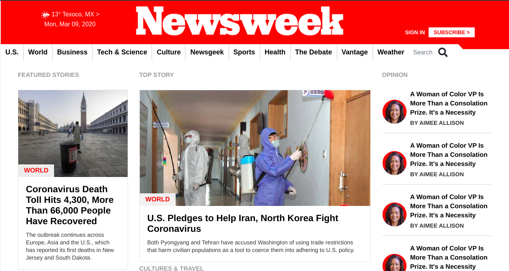

# Newsweek Responsive Clone

> This a clone of The Newsweek website, where all the responsiveness capabilities have been included.

- Original: https://newsweek.com/

## Built With

- HTML5, CSS3
- Flexbox, Grid, Float
- Bootstrap 4

## Live Demo

[Hosted on GitHack](https://rawcdn.githack.com/ghamtre/newsweek/da10aef9915e36d0aef3b19b1b3d2fbc6ccfdee4/index.html)

## Created by

👤 **Isaac Gonzalez**

- Github: [@ghamtre](https://github.com/ghamtre)
- Twitter: [@idgm5](https://twitter.com/idgm5)
- Linkedin: [linkedin](https://www.linkedin.com/in/isaacmunguia)

## 🤝 Contributing

Contributions, issues and feature requests are welcome!

Feel free to check the [issues page](issues/).

## Show your support

Give a ⭐️ if you like this project!

## Acknowledgments

- Thanks to #Team94 for helping me in understand Bootstrap.
